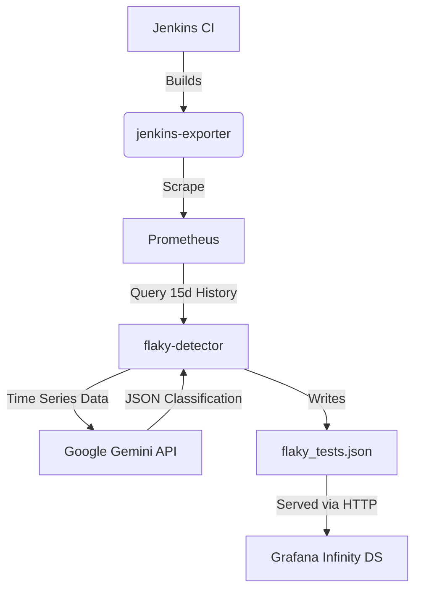

# AI-Driven Flaky Test Detection Agent

## Overview

The `flaky-detector` is an observability agent designed to restore trust in the CI/CD pipeline. It tackles the "Crisis of Determinism" by distinguishing between legitimate code regressions and non-deterministic "flaky" tests.

Unlike static dashboards that merely count failures, this tool:

1.  **Harvests** historical failure patterns from Prometheus (via `jenkins-exporter`).
2.  **Reconstructs** sparse time-series signals (inferring "pass" states where data is missing).
3.  **Analyzes** these patterns using Google's **Gemini Pro** LLM to identify chaotic oscillation vs. linear regression.
4.  **Exposes** the results as a JSON endpoint for real-time visualization in Grafana.

## Architecture



## Repository Structure

```text
.
├── Dockerfile              # Multi-stage build for the agent & web server
├── entrypoint.sh           # Orchestrates the web server and detection loop
├── requirements.txt        # Python dependencies
├── src/
│   ├── flaky_detector.py   # Core logic: Prometheus fetch + Gemini Analysis
│   └── serve_results.py    # Sidecar HTTP server for Grafana
└── README.md
```

## Configuration

The application requires a configuration file (YAML). When running in Docker, this file is expected at `/app/config.yaml`.

### `config.yaml` Structure

```yaml
prometheus:
  url: "PROMETHEUS_URL"
  job_name: "JENKINS_JOB_NAME"
  lookback_days: 60
  step_seconds: 3600 # 1 hour resolution

gemini:
  api_key: "YOUR_GOOGLE_API_KEY"
  model: "gemini-2.5-flash"

output:
  directory: "/data"
  filename: "flaky_tests.json"
```

## Running locally (Docker)

To run the full stack (Detector + Web Server) locally:

1.  **Build the Image:**

    ```bash
    docker build -t flaky-detector .
    ```

2.  **Prepare Config:**
    Create a local `config.yaml` (see above) and a data directory.

3.  **Run Container:**

    ```bash
    docker run -d \
      --name flaky-detector \
      -p 8080:8080 \
      -v $(pwd)/config.yaml:/app/config.yaml:ro \
      -v $(pwd)/data:/data \
      -e CHECK_INTERVAL=3600 \
      flaky-detector
    ```

      * **CHECK\_INTERVAL**: Time in seconds between analysis runs (Default: 14400 / 4 hours).
      * **Port 8080**: Exposes the `flaky_tests.json` file.

## Running locally (Python)

For development or debugging scripts without Docker:

```bash
# Install deps
pip install -r requirements.txt

# Run the detector
python3 src/flaky_detector.py --config config.yaml

# Run the server
python3 src/serve_results.py --dir ./data
```

## Deployment (Salt states)

This service can be deployed via Salt to a monitoring infrastructure.

  * **Registry:** `ghcr.io/srbarrios/jenkins-flaky-tests-detector`
  * **Salt State:** `monitoring.jenkins_flaky_tests_detector`
  * **Pillar:** Secrets (API Keys) are managed in the Salt Pillar.

The Salt state handles the creation of the configuration file (injecting secrets) and the management of the Docker container lifecycle.

/srv/salt/monitoring/jenkins_flaky_tests_detector/jenkins_flaky_tests_detector.sls:
```YAML
# 1. Create the Host Directory for Persistence and Config
/data/jenkins-flaky-tests-detector:
  file.directory:
    - user: root
    - group: root
    - mode: 755
    - makedirs: True

# 2. Deploy the Configuration File (Templated with Secrets)
/data/jenkins-flaky-tests-detector/config.yaml:
  file.managed:
    - source: salt://monitoring/files/jenkins_flaky_tests_detector_config.yaml.j2
    - template: jinja
    - user: root
    - group: root
    - mode: 644
    - require:
      - file: /data/jenkins-flaky-tests-detector
    - defaults:
        # Pull secrets from Salt Pillar
        api_key: {{ pillar['flaky_tests_detection']['gemini_api_key'] }}
        prom_url: {{ pillar['flaky_tests_detection']['prometheus_url'] }}
        job_name: {{ pillar['flaky_tests_detection']['job_name'] }}
        # Hardcode internal container paths
        output_dir: "/data"

# 3. Run the Docker Container
jenkins-flaky-tests-detector:
  docker_container.running:
    - name: jenkins-flaky-tests-detector
    - image: ghcr.io/srbarrios/jenkins-flaky-tests-detector:latest
    - binds:
      # Mount the config file to where the python script expects it
      - /data/jenkins-flaky-tests-detector/config.yaml:/app/config.yaml:ro
      # Mount the data directory so the JSON persists if container restarts
      - /data/jenkins-flaky-tests-detector/output:/data
    - port_bindings:
      - <THE_EXPOSED_PORT>:8080
    - environment:
      - CHECK_INTERVAL: 14400 # 4 Hours in seconds
    - restart_policy: always
    - detach: True
    - watch:
      - file: /data/jenkins-flaky-tests-detector/config.yaml
```
/srv/salt/monitoring/jenkins_flaky_tests_detector/jenkins_flaky_tests_detector_config.yaml.j2:
```YAML
prometheus:
  url: "{{ prom_url }}"
  job_name: "{{ job_name }}"
  lookback_days: 60
  step_seconds: 3600

gemini:
  api_key: "{{ api_key }}"
  model: "gemini-1.5-pro-latest"

output:
  # This points to the internal container path defined in Dockerfile/Entrypoint
  directory: "{{ output_dir }}" 
  filename: "flaky_tests.json"
```

/srv/pillar/monitoring.sls
```YAML
flaky_tests_detection:
  prometheus_url: "http://..." 
  gemini_api_key: "..."
  job_name: "..."
```

## Grafana Integration

To visualize the data, create a new panel using the **Infinity Data Source**.

1.  **URL**: `http://<container_host_ip>:8080/flaky_tests.json`
2.  **Parser**: Backend
3.  **UQL Query**:
    ```text
    parse-json
    | project "test_suite", "test_case", "flakiness_score", "failure_pattern", "reasoning"
    | filter "flakiness_score" > 0.5
    | order by "flakiness_score" desc
    ```

Grafana Dashboard example:
```JSON
{
  "annotations": {
    "list": [
      {
        "builtIn": 1,
        "datasource": {
          "type": "datasource",
          "uid": "grafana"
        },
        "enable": true,
        "hide": true,
        "iconColor": "rgba(0, 211, 255, 1)",
        "name": "Annotations & Alerts",
        "type": "dashboard"
      }
    ]
  },
  "editable": true,
  "fiscalYearStartMonth": 0,
  "graphTooltip": 0,
  "id": 114,
  "links": [],
  "panels": [
    {
      "datasource": "FlakyTests",
      "fieldConfig": {
        "defaults": {
          "color": {
            "mode": "thresholds"
          },
          "custom": {
            "align": "left",
            "cellOptions": {
              "type": "auto"
            },
            "filterable": true,
            "inspect": false
          },
          "fieldMinMax": false,
          "mappings": [
            {
              "options": {
                "ENVIRONMENTAL": {
                  "color": "blue",
                  "index": 2,
                  "text": "INFRA"
                },
                "FIXED": {
                  "color": "purple",
                  "index": 3,
                  "text": "FIXED"
                },
                "FLAKY": {
                  "color": "yellow",
                  "index": 0,
                  "text": "FLAKY"
                },
                "REGRESSION": {
                  "color": "red",
                  "index": 1,
                  "text": "REGRESSION"
                },
                "STABLE": {
                  "color": "green",
                  "index": 4,
                  "text": "OK"
                }
              },
              "type": "value"
            }
          ],
          "thresholds": {
            "mode": "absolute",
            "steps": [
              {
                "color": "green"
              },
              {
                "color": "#EAB839",
                "value": 0.5
              },
              {
                "color": "red",
                "value": 0.8
              }
            ]
          }
        },
        "overrides": [
          {
            "matcher": {
              "id": "byName",
              "options": "failure_pattern"
            },
            "properties": [
              {
                "id": "custom.cellOptions",
                "value": {
                  "type": "color-text",
                  "wrapText": false
                }
              },
              {
                "id": "custom.width",
                "value": 100
              },
              {
                "id": "displayName",
                "value": "Type"
              }
            ]
          },
          {
            "matcher": {
              "id": "byName",
              "options": "flakiness_score"
            },
            "properties": [
              {
                "id": "custom.cellOptions",
                "value": {
                  "mode": "lcd",
                  "type": "gauge",
                  "valueDisplayMode": "hidden"
                }
              },
              {
                "id": "min",
                "value": 0
              },
              {
                "id": "max",
                "value": 1
              },
              {
                "id": "custom.width",
                "value": 150
              },
              {
                "id": "displayName",
                "value": "Flakiness score"
              }
            ]
          },
          {
            "matcher": {
              "id": "byName",
              "options": "Flakiness score"
            },
            "properties": [
              {
                "id": "custom.width",
                "value": 134
              }
            ]
          }
        ]
      },
      "gridPos": {
        "h": 20,
        "w": 24,
        "x": 0,
        "y": 0
      },
      "id": 2,
      "options": {
        "cellHeight": "sm",
        "footer": {
          "countRows": false,
          "enablePagination": false,
          "fields": "",
          "reducer": [
            "sum"
          ],
          "show": false
        },
        "showHeader": true,
        "sortBy": []
      },
      "pluginVersion": "11.6.7",
      "targets": [
        {
          "columns": [],
          "datasource": "FlakyTests",
          "filters": [],
          "format": "table",
          "global_query_id": "",
          "parser": "backend",
          "refId": "A",
          "root_selector": "",
          "source": "url",
          "type": "json",
          "uql": "parse-json\n| project \"test_suite\", \"test_case\", \"failure_pattern\", \"flakiness_score\", \"reasoning\"\n| order by \"flakiness_score\" desc",
          "url": "http://localhost:9184/flaky_tests.json",
          "url_options": {
            "data": "",
            "method": "GET"
          }
        }
      ],
      "title": "Flaky Test Analysis",
      "transformations": [
        {
          "id": "organize",
          "options": {
            "excludeByName": {},
            "includeByName": {},
            "indexByName": {
              "failure_pattern": 2,
              "flakiness_score": 3,
              "reasoning": 4,
              "test_case": 1,
              "test_suite": 0
            },
            "renameByName": {}
          }
        }
      ],
      "type": "table"
    }
  ],
  "preload": false,
  "refresh": "1m",
  "schemaVersion": 41,
  "tags": [
    "ci",
    "quality"
  ],
  "templating": {
    "list": []
  },
  "time": {
    "from": "now-6h",
    "to": "now"
  },
  "timepicker": {},
  "timezone": "",
  "title": "Flaky Tests Detection",
  "uid": "flaky-tests",
  "version": 1
}
```

### Recommended Overrides

  * **flakiness\_score**: Set unit to `Percent (0-1.0)`.
  * **Thresholds**: Green (\< 20%), Red (\> 80%).

## Troubleshooting

**Logs:**
View the logs of the detection process:

```bash
docker logs -f flaky-detector
```

**Common Errors:**

  * `401 Unauthorized`: Check your Gemini API key in `config.yaml`.
  * `Empty JSON`: Check if Prometheus is reachable or if the Job Name in config matches existing metrics.
  * `Connection Refused`: Ensure the container port 8080 is mapped correctly.
