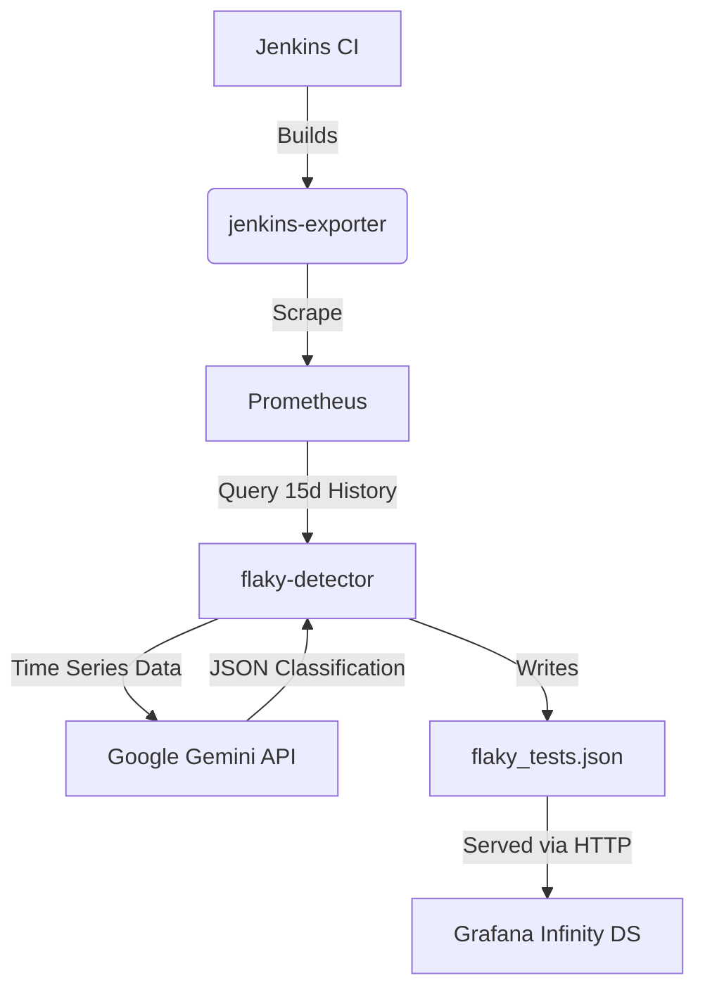

# AI-Driven Flaky Test Detection Agent

## Overview

The `flaky-detector` is an observability agent designed to restore trust in the CI/CD pipeline. It tackles the "Crisis of Determinism" by distinguishing between legitimate code regressions and non-deterministic "flaky" tests.

Unlike static dashboards that merely count failures, this tool:

1.  **Harvests** historical failure patterns from Prometheus (via `jenkins-exporter`).
2.  **Reconstructs** sparse time-series signals (inferring "pass" states where data is missing).
3.  **Analyzes** these patterns using Google's **Gemini Pro** LLM to identify chaotic oscillation vs. linear regression.
4.  **Exposes** the results as a JSON endpoint for real-time visualization in Grafana.

## Architecture



## Repository Structure

```text
.
├── Dockerfile              # Multi-stage build for the agent & web server
├── entrypoint.sh           # Orchestrates the web server and detection loop
├── requirements.txt        # Python dependencies
├── src/
│   ├── flaky_detector.py   # Core logic: Prometheus fetch + Gemini Analysis
│   └── serve_results.py    # Sidecar HTTP server for Grafana
└── README.md
```

## Configuration

The application requires a configuration file (YAML). When running in Docker, this file is expected at `/app/config.yaml`.

### `config.yaml` Structure

```yaml
prometheus:
  url: "http://nsa.mgr.suse.de/graph"
  job_name: "uyuni-main-pipeline"
  lookback_days: 15
  step_seconds: 3600 # 1 hour resolution

gemini:
  api_key: "YOUR_GOOGLE_API_KEY"
  model: "gemini-1.5-pro-latest"

output:
  directory: "/data"
  filename: "flaky_tests.json"
```

## Running locally (Docker)

To run the full stack (Detector + Web Server) locally:

1.  **Build the Image:**

    ```bash
    docker build -t flaky-detector .
    ```

2.  **Prepare Config:**
    Create a local `config.yaml` (see above) and a data directory.

3.  **Run Container:**

    ```bash
    docker run -d \
      --name flaky-detector \
      -p 8080:8080 \
      -v $(pwd)/config.yaml:/app/config.yaml:ro \
      -v $(pwd)/data:/data \
      -e CHECK_INTERVAL=3600 \
      flaky-detector
    ```

      * **CHECK\_INTERVAL**: Time in seconds between analysis runs (Default: 14400 / 4 hours).
      * **Port 8080**: Exposes the `flaky_tests.json` file.

## Running locally (Python)

For development or debugging scripts without Docker:

```bash
# Install deps
pip install -r requirements.txt

# Run the detector
python3 src/flaky_detector.py --config config.yaml

# Run the server
python3 src/serve_results.py --dir ./data
```

## Deployment (SaltStack)

This service is deployed via SaltStack to the monitoring infrastructure.

  * **Registry:** `registry.mgr.suse.de/flaky-detector`
  * **Salt State:** `monitoring.flaky_detection`
  * **Pillar:** Secrets (API Keys) are managed in the Salt Pillar.

The Salt state handles the creation of the configuration file (injecting secrets) and the management of the Docker container lifecycle.

## Grafana Integration

To visualize the data, create a new panel using the **Infinity Data Source**.

1.  **URL**: `http://<container_host_ip>:8080/flaky_tests.json`
2.  **Parser**: Backend
3.  **UQL Query**:
    ```text
    parse-json
    | project "test_suite", "test_case", "flakiness_score", "failure_pattern", "reasoning"
    | filter "flakiness_score" > 0.5
    | order by "flakiness_score" desc
    ```

### Recommended Overrides

  * **flakiness\_score**: Set unit to `Percent (0-1.0)`.
  * **Thresholds**: Green (\< 20%), Red (\> 80%).

## Troubleshooting

**Logs:**
View the logs of the detection process:

```bash
docker logs -f flaky-detector
```

**Common Errors:**

  * `401 Unauthorized`: Check your Gemini API key in `config.yaml`.
  * `Empty JSON`: Check if Prometheus is reachable or if the Job Name in config matches existing metrics.
  * `Connection Refused`: Ensure the container port 8080 is mapped correctly.
